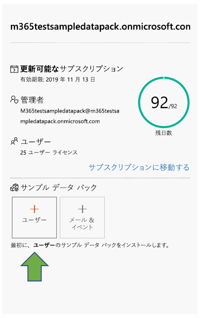
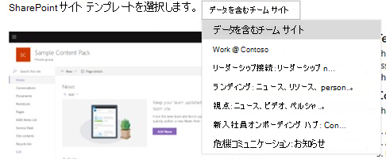

# Microsoft 365 開発者プログラム サブスクリプションでサンプル データ パックを使用する

Microsoft 365 開発者プログラム サブスクリプションにサンプル データ パックをインストールすることができます。 サンプル データ パックは、ソリューションの構築とテストに必要なデータとコンテンツを自動的にインストールするため、時間を節約することができます。 これには、小規模の企業環境をシミュレートするための架空のユーザー、メタデータ、および写真が含まれます。 サンプル データをすばやくインストールできるため、サンプル データを自分で作成することに時間を費やすことなく、ソリューションに集中することができます。

サンプル データ パックは、サブスクリプション タイルの下部にある [Microsoft 365 開発者プログラム ダッシュボード](https://developer.microsoft.com/office/profile)にあります。

現在、次のサンプル データ パックをご利用になれます。

- ユーザー - 各ユーザーの名前および写真を含むライセンスとメールボックスのある 16 人の架空のユーザーをインストールします。 Microsoft Graph API を使用して、次の方法でユーザー サンプル データを操作します。
  - 特定のユーザーの詳細を取得する
  - ユーザーを更新する
  - 直属の部下を取得する
  - 組織図を準備する  
  - 部署別にユーザーを取得する

- メールとイベント - 各 16 人のサンプル ユーザーに Outlook メールの会話とカレンダーのイベントを追加します。 Microsoft Graph API を使用して、次の方法でメールとイベント サンプル データを操作します。
  - ユーザーがメールを取得する
  - 日付でフィルター処理されたメールを取得する
  - 今後のイベントを取得する
  - 今後のイベントを更新/削除する

> [!NOTE]
> メールとイベントをインストールする前に、ユーザー サンプル データ パックをインストールする必要があります。

## サンプル データ パックは、サブスクリプションに何を追加しますか?

ユーザー サンプル データ パックは、サブスクリプションに 16 人の架空のユーザーを作成します。各ユーザーのライセンスと、各ユーザーのメールボックス、名前、メタデータ、写真が含まれます。

メールとイベントのサンプル データ パックによって、インストールされた各 16 人のユーザーに Outlook メールの会話とカレンダーのイベントが追加されます。

## ユーザー サンプル データ パックをインストールする方法

ユーザー サンプル データ パックをインストールする前に、Microsoft 365 開発者サブスクリプションを取得していて、管理者として自分にライセンスを割り当てていることを確認します。

> [!NOTE]
> サブスクリプションで 16 人のユーザーが利用できることを確認します。 サブスクリプションには、25 人のユーザーが含まれます。 既に 10 人以上で構成されている場合は、最初に複数のユーザーを削除してインストールが成功したことを確認します。

ユーザー サンプル データ パックをインストールするには、次の操作を行います。

1. サブスクリプション タイルの下部にある [**ユーザー**] ボックスを選択します。
2. 管理者 ID をコピーします。サブスクリプションにサインインする際に、アカウントが必要です。
3. サインイン ページで、管理者 ID とパスワードを入力します。
4. Microsoft 365 開発者サブスクリプションの管理者としての権限に同意します。

5. すべてのサンプル ユーザーのパスワードを設定します。 すべての架空のユーザーを簡単に管理できるように、1 つの共有パスワードを定義する必要があります。

6. データがインストールされます。 インストールには約 5 分ほどかかります。

7. インストールが完了すると、メールで通知され、サブスクリプション タイルのボックスは緑色になります。 メールとイベントのサンプル データ パックをインストールできるようになりました。

## メールとイベントのサンプル データ パックをインストールする方法

ユーザー サンプル データ パックをインストールした後、メールとイベントをインストールすることができます。

1. サブスクリプション タイルの [**メール &amp; イベント**] ボックスを選択します。
2. [**インストール**] を選択して、インストールを開始します。

> [!NOTE]
> サブスクリプションを作成したばかりの場合は、インストールを開始する前にそのサブスクリプションを完全にプロビジョニングする必要があります。 これには数時間かかる場合があります。 インストールが開始された後、終了には最大 20 分かかります。

3. インストールが完了すると、メールで通知され、サブスクリプション タイルのボックスは緑色になります。

## SharePoint サンプル データ パックをインストールする方法

SharePoint サンプル データ パックには 7 種類の SharePoint サイト テンプレートが含まれており、これを選択してコラボレーション、コミュニケーション、エンゲージメント、知識管理用に SharePoint ソリューションを体験しモデル化できます。

これらは[SharePoint PnP look book](https://provisioning.sharepointpnp.com/) の中の最も人気のあるテンプレートです。 今日では、任意のデバイスや画面に美しく表示される、美しく高速なサイトおよびかっこいいページのサンプル ソリューションを簡単に作成できます。 これらのデザインからインスピレーションを得たり、三度ボックス テナントに追加して、次のサイトの構築を始めましょう。

テンプレートはサブスクリプションにインストールできます。 テンプレートを 1 つインストールすると、その他のテンプレートをインストールするオプションを得ることができます。 インストール プロセスには、以下の手順が含まれます。

1. ドロップダウン メニューから希望のテンプレートを選びます。

  

2. サイトのカスタム オプションを設定するか、既定値を受け入れます。
3. サンドボックス テナントの管理者 ID とパスワードを使用して、認証を行い、インストールするアクセス許可を与えます。 

インストールが自動的に始まります。

>**メモ:** これらのサイト テンプレートのプロビジョニングは、英語版の Office 365 E3 または Microsoft 365 E5 開発者サブスクリプションでのみ機能し、含まれるすべてのコンテンツは英語のみです。

## 使用可能な SharePoint テンプレートは?

SharePoint サンプル パックには、7 種類のテンプレートが含まれています。

### データが含まれるチーム サイト

データが含まれるチーム サイのテンプレートには、SharePoint チーム サイトに自動的に関連付けられる複数のドキュメント ライブラリが含まれています。SharePoint Framework、PowerApps、Microsoft Graph を使用してソリューションを開発する際に役立ちます。

このテンプレートには、次のデータが含まれます。

- 事前入力された連絡先を含む連絡先リスト
- 6000を超えるアイテムが含まれるリスト
- サンプルの PowerPoint、Excel、Word、および OneNote のドキュメントを含むドキュメントライブラリ
- お知らせアイテムを含むイベントリスト

このテンプレートは、ユーザーのサンプル データと統合されます。

### Contoso で働く
Contoso で働くテンプレートは複数のサイト コレクションで構成されています。すべての既定の集計機能がどのように機能するかを示すため、これらはすべて自動的にハブ サイトに関連付けられます。

このテンプレートには、次の構造とアセットが含まれます。

- ハブ サイトとしてのメイン サイト コレクション セット
- ハブ サイトに関連付けられた 2 種類のコミュニケーション サイト (福利厚生サイトとチャリティ サイト)
- ハブ サイトに関連付けられた 1 種類のグループ チーム サイト (チーム サイト)
- サブサイト コレクションのサンプル ニュース記事
- Word、Excel、PowerPoint のサンプル ファイル
- サイト コレクションで使用している画像コンテンツのサンプル

サブサイト コレクションでも同じテンプレートが使用されています。このテンプレートは、このサービスとは別に提供することもできます。

>**メモ:** このテンプレートを既存のコミュニケーション サイトに適用した場合、ウェルカム ページのコンテンツが上書きされます。

### リーダーシップ コネクション: リーダーシップ ニュース、イベント、エンゲージメント

このリーダーシップ サイトでは、リーダーシップ チームの目標と優先事項を理解する手掛かりを提供し、イベントおよび会話へのエンゲージメントを生み出します。

このデザインをテナントに追加すると、次のコンテンツが作成されます。

- Web パーツのデモを含むウェルカム ページのサンプル
- 様々なモダン ページのデザインのデモを含むニュース記事のサンプル

このテンプレートは、ユーザーのサンプル データと統合されます。

### Landing : ニュース、リソース、個人用コンテンツ

このコミュニケーション サイトは、従業員がニュースや必要なリソースに加え、従業員に合った個人用コンテンツを検索できる場所となるように設計されています。

このデザインをテナントに追加すると、次のコンテンツが作成されます。

- ポータルのホーム サイトのデモ構造
- カスタム ウェルカム ページ構造
- 6 種類のモダン ページとニュース記事のサンプル
- サンプル画像と Office ドキュメント

### Perspective: ニュース、ビデオ、個人用コンテンツ

ニュースや個人用コンテンツを提供するよう設計されているこのサイトには、さらに多くのエンゲージメントを生み出すビデオも含まれています。
このデザインをテナントに追加すると、次のコンテンツが作成されます。

- カスタム ウェルカム ページのデザイン
- ニュース記事用のサンプル ページ テンプレート
- 12 種類のサンプル ニュース記事

### 新しい従業員のオンボーディング ハブ: 接続、エンゲージメント、情報提供

プレオンボーディング、企業レベルのオンボーディング、部門レベルのオンボーディング シナリオをカバーする既成テンプレートで、新入社員オンボーディングのプロセスを効率化し、洗練化します。 このデジタルなソリューションは、4 種類のサイト テンプレートを提供します。これには、組織の目標に応じてカスタマイズ可能な事前に用意されたコンテンツが含まれます。

このデザインをテナントに追加すると、次のコンテンツが作成されます。

- プレオンボーディング サイト、企業オンボーディング サイト、2 種類の部門オンボーディング サイト
- 各サイトで使用できる、事前に用意されたカスタム ホーム ページ
- 企業オンボーディングのために構成されたハブ サイトと、部門オンボーディングのための関連サイト
- 新入社員のオンボーディングを成功させるのに役立つ、SharePoint のリストに構築された新入社員チェックリスト
- 連絡先 Web パーツ、Yammer Web パーツ、ニュース Web パーツ、クイック リンク Web パーツ用のサンプル コンテンツ
- 各サイトで使用できる、事前に記入された FAQ
- YouTube Web パーツを使用してプレオンボーディング サイトにウェルカム ビデオを含めるなど、交流とエンゲージメントを促進するエクスペリエンスを作るためのおすすめ候補

### Crisis Communication: お知らせ、ニュース、リソース、コミュニティ、実施すべき内容

異常気象現象、医療上や保安上の緊急事態などの非常時でも、ユーザーに情報を提供し、エンゲージメントを保ち、前進するよう助けます。 このテンプレートは、重要なニュースや告知を共有するリーダーや通信者のための中心的なリソースを作成し、人々に最新の情報を提供する真実の単一ソースであり、組織全員を接続する場所となります。

このデザインをテナントに追加すると、次のコンテンツが作成されます。

- Web パーツを使用して構築されたカスタムのウェルカム ページ
- コンテンツを含む 4 種類のニュース記事

このテンプレートは、ユーザーのサンプル データと統合されます。

## サンプル データ パックは追加されますか?

はい。 将来、Microsoft Teams など、他の製品とテクノロジのサンプル データ パックを追加することを検討しています。 サンプル データ パックに関してご提案のある場合は[お知らせください](https://officespdev.uservoice.com/forums/224641-feature-requests-and-feedback?category_id=171306)。

## サンプル データ パックを他の Microsoft 365 サブスクリプションにインストールできますか?

いいえ。 これらのサンプル データ パックは、Microsoft 365 開発者プログラムの一部として取得した Microsoft 365 開発者サブスクリプションとのみ互換性があります。

## サンプル データをサブスクリプションに表示するにはどのようにすればよいですか?

ユーザーのサンプル データ パックのインストール後に、追加されたユーザーを表示するには、Microsoft 365 開発者サブスクリプションの [**Microsoft 365 管理センター**](https://admin.microsoft.com/) に移動します。 [**ユーザー**] の下で [**アクティブなユーザー**] を選択します。 16 人のユーザーの一覧が表示されます。 ユーザーを選択すると、写真やライセンスを含む関連付けられたメタデータを表示できます。

メールとイベントのサンプル パックのインストール後にサンプル データを表示するには、[**Microsoft 365 管理センター**](/microsoft-365/admin/admin-overview/about-the-admin-center?view=o365-worldwide)で [**すべて表示**] を選択して、[**Exchange**] を選択します。 Exchange 管理センターで [**受信者**] を選択すると、16 人のユーザーそれぞれがメールボックスを持ち、メールやイベントが追加されていることを確認できます。

## 関連項目

- [Microsoft 365 開発者サブスクリプションを設定する](microsoft-365-developer-program-get-started.md)
