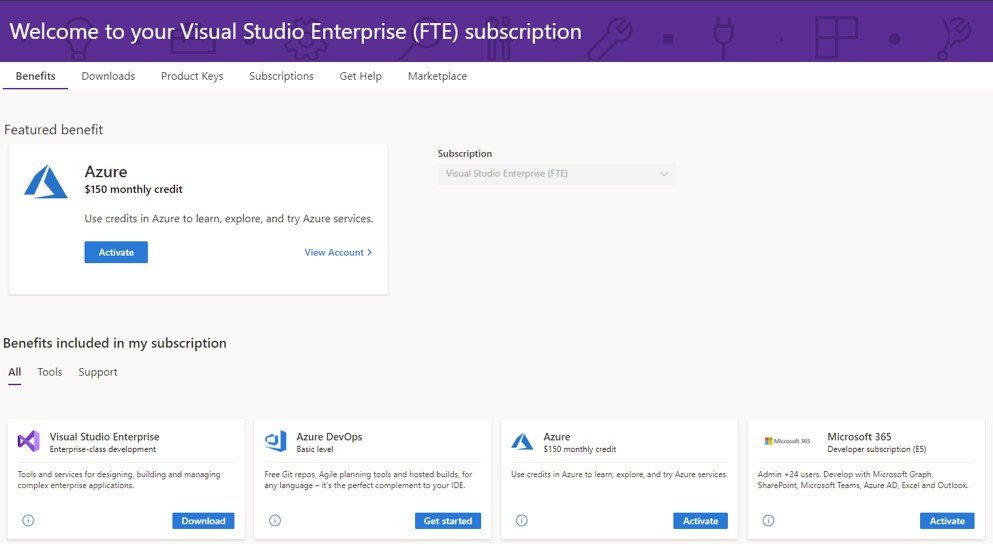

# Visual Studio Professional または Enterprise サブスクリプションを使用して Microsoft 365 開発者プログラムに参加する

Office 365 開発者プログラムのすべての新しいメンバー (Visual Studio Professional および Enterprise サブスクライバーを含みます) は、Microsoft 365 E5 開発者サブスクリプション (Windows は含まれていません) にサインアップできます。 

Visual Studio Professional または Enterprise 標準サブスクリプションを選択すると、サブスクリプションがアクティブな間、Microsoft 365 開発者サブスクリプション特典を利用できます。 有料の Visual Studio Professional または Enterprise サブスクリプションは、無料で更新可能な Microsoft 365 開発者サブスクリプションを最大 25 人までと共有できる権利を付与します。 これは、開発およびテスト目的で企業ドメインの外で独自のサンドボックスを作成する状況で役立ちます。

また、Microsoft 365 開発者プログラムの特殊な状態が付与されます。 Visual Studio Professional および Enterprise サブスクリプションがアクティブな間は、サブスクリプションは自動的に更新されます。

## 更新可能な Microsoft 365 開発者サブスクリプションを取得する方法

Visual Studio Professional または Enterprise サブスクリプションをお持ちでない場合は、[Visual Studio サブスクリプション](https://visualstudio.microsoft.com/vs/pricing/) ページを参照してください。

Visual Studio Professional または Enterprise サブスクリプションを既にお持ちの場合は、Visual Studio サブスクライバー ポータルから Microsoft 365 開発者サブスクリプションを取得できます。 [https://my.visualstudio.com](https://my.visualstudio.com) に移動して、**Microsoft 365 開発者サブスクリプション (E5)** タイルをクリックすると、Visual Studio ID を使用して Microsoft 365 開発者プログラムに自動的に参加します。

## 直接プログラムに参加する場合と Visual Studio サブスクリプションを使用して参加する場合の違い

Visual Studio サブスクリプションを使用して Microsoft 365 開発者プログラムに参加すると、Visual Studio サブスクリプションがアクティブな間、Microsoft 365 E5 開発者サンドボックス サブスクリプションは自動的に更新されます。 

開発者プログラムに直接参加すると、Microsoft 365 E5 開発者サンドボックス サブスクリプションは、開発作業に基づいて 90 日ごとに更新されます。 詳細については、「[サブスクリプションの有効期限と更新](subscription-expiration-and-renewal.md)」を参照してください。