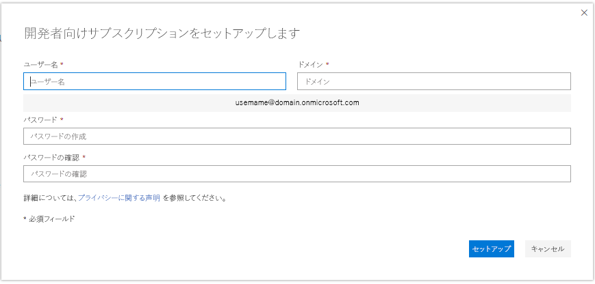

# Microsoft 365 開発者サンドボックス サブスクリプションの設定Set up a Microsoft 365 developer sandbox subscription 

運用環境に依存しないソリューションを構築するための Microsoft 365 開発者サブスクリプションを設定します。Set up a Microsoft 365 developer subscription to build your solutions independent of your production environment. サブスクリプションは、25 ユーザー ライセンス付きの Microsoft 365 E5 開発者用のサブスクリプションです。The subscription is a Microsoft 365 E5 Developer subscription with 25 user licenses. 90日間有効で、開発目的 (コーディングのソリューション) のみに無料で使用できます。It lasts for 90 days and is free to use for development purposes (coding solutions) only. 

> [!NOTE] 
> サブスクリプションを設定するには、最初に直接 [Microsoft 365 開発者プログラムに参加](microsoft-365-developer-program.md) するか、Visual Studio Profressional または Enterprise (サブスクライバーの場合) を使用して参加する必要があります。To set up a subscription, you must first [join the Microsoft 365 Developer Program](microsoft-365-developer-program.md) directly or through Visual Studio Profressional or Enterprise (if you're a subscriber). 参加すると、サブスクリプションの設定のためのオプションが表示されます。After joining, you'll see the option to set up a subscription.

## Microsoft 365 E5 サンドボックス サブスクリプションをセットアップするSet up your Microsoft 365 E5 sandbox subscription

1. Microsoft 365 開発者サブスクリプションを取得するには、プロファイル ページで **[サブスクリプションの設定]** を選択します。To get a Microsoft 365 developer subscription, on your profile page, choose **Set up subscription**.

2. **開発者向けのサブスクリプションをセットアップ** ダイアログ ボックスで、ユーザー名とドメインを作成します。In the **Set up your developer subscription** dialog box, create a username and domain. このアカウントは、サブスクリプションのグローバル管理者の権限を持ちます。This account will have global administrator permissions for the subscription. 既に使われているものでなければ、任意のユーザー名またはドメイン名を選ぶことができます。You can choose any username or domain name as long as it is not already in use. スペースは使用できません。Do not use spaces.

  

3. パスワードを作成し、確認します。Create and confirm a password.

4. **設定** を選択します。Choose **Set up**.

5. ロボットでないことを証明するよう求められたら、指示に従い **検証** を選択します。If you are asked to prove that you're not a robot, follow the instructions, and then choose **Verify**.

6. サブスクリプションが作成されると、プロファイル ページにサブスクリプションの名前と有効期限が表示されます。After the subscription is created, your subscription name and expiration date appear on your profile page.

  > [!IMPORTANT]
  > 開発者サブスクリプションにアクセスするときに必要なので、ユーザー名とパスワードをメモします。Make a note of your username and password because you'll need it to access your developer subscription.

## サブスクリプションの設定Configure the subscription

1. プロファイル ページで [**サブスクリプションに移動**] を選択し、ユーザー ID (例: username@domain.onmicrosoft.com) と、開発者向けサブスクリプション用に指定したパスワードを使用してサインインします。On your profile page, choose **Go to subscription** and sign in with your user ID (for example, username@domain.onmicrosoft.com) and the password that you specified for your developer subscription.

   > [!NOTE] 
   > サブスクリプションへのサインインには、開発者プログラムのアカウント ID を使用しないでください。Do not sign in to your subscription with your Developer Program account ID.

2. アプリ起動ツールを使用して、[管理センター](https://admin.microsoft.com/AdminPortal/Home#/homepage)へ移動します。Use the app launcher to go to the [Admin center](https://admin.microsoft.com/AdminPortal/Home#/homepage).

3. 管理センターのホーム ページで、**設定へ移動** を選択します。On the Admin center home page, choose **Go to setup**. [**Microsoft 365 E5 開発者セットアップ**] ページに移動します。This takes you to the **Microsoft 365 E5 Developer Setup** page.

4. **サインインとメールをカスタマイズ**。**Personalize your sign-in and email**. サブスクリプションをドメインに接続することができます。また、作成した既存のサブドメインも使用できます。You can connect your subscription to a domain, or just use the existing subdomain that you created. 準備ができたら、**次へ** を選択します。When ready, choose **Next**.

5. **新規ユーザーの追加**。**Add new users**. 架空のユーザーまたは実在のユーザーを追加して、開発に役立てることができます。You can add fictitious or real users to help you with development. 準備ができたら、**[次へ]** を選択します。When ready, choose **Next**.
    
  > [!NOTE]
  > サブスクリプションを設定した後は、ユーザーのサンプル データ パックをインストールできます。After you set up your subscription, you can install the Users sample data pack. ユーザー サンプル データ パックは、サブスクリプションに 16 人の架空のユーザーを作成します。各ユーザーのライセンスと、各ユーザーのメールボックス、名前、メタデータ、写真が含まれます。The Users sample data pack creates 16 fictitious users on your subscription, and includes the licenses for each user, and mailboxes, names, metadata, and photos for each. 詳細については、「[サンプル データ パックのインストール](install-sample-packs.md)」を参照してください。For details, see [Install sample data packs](install-sample-packs.md).

6. **ライセンスのないユーザーにライセンスを割り当てる**。**Assign licenses to unlicensed users**. すべてのユーザーに関して、サブスクリプションで作業できるようにするには、ライセンスを付与します。For any users that you want to be able to work with the subscription, grant them a license. 準備ができたら、**次へ** を選択します。When ready, choose **Next**.

7. **サインインの資格情報を共有**。**Share sign-in credentials**. サブスクリプションにアクセスする実際のユーザーすべてに、サインインの資格情報をそのユーザーと共有する必要があります。For any real users that will access the subscription, you must share their sign-in credentials with them. メール、ダウンロード、または印刷などの方法を選択することができます。You can choose a method, such as email, download, or print. 準備ができたら、**次へ** を選択します。When ready, choose **Next**.

8. **Office アプリのインストール**。**Install your Office apps**. 使用しているコンピューターに Office アプリをインストールするオプションがあります。You have the option of installing Office apps to your computer. 準備ができたら、**次へ** を選択します。When ready, choose **Next**.

   > [!TIP] 
   > 次回ダッシュ ボードにアクセスするときに、ダッシュ ボードに移動する前に *username@domain*.onmicrosoft.com アカウントでサインインします。On subsequent visits to the Dashboard, sign in with your *username@domain*.onmicrosoft.com account before you go to the Dashboard.

9. **設定が完了しました**。**You've reached the end of setup**. サブスクリプションの設定が完了しました。You've completed the setup for your subscription. 必要に応じて、この操作を評価できます。You can optionally rate the experience. 準備ができたら、**管理センターに移動** を選択します。When ready, choose **Go to the Admin center**.
    
   > [!NOTE] 
   > 現時点では、お客様のいる国/地域に関わらず、サブスクリプションの地域は既定で北アメリカに設定されています。At this time, the subscription's region defaults to North America regardless of which country/region you are in. 設定に進み、開発者向けのサブスクリプションを使用することもできます。You can still proceed with setting up and using your developer subscription.

## Microsoft 365 サービスのプロビジョニングProvision Microsoft 365 services

サブスクリプションの SharePoint や Exchange などのバックエンドサービスのプロビジョニングには、少々時間がかかります。It will take some time for the backend services, such as SharePoint and Exchange, to provision for the subscription. この手順では、アプリ起動ツールとホーム ページの中の一部のアイコンは **設定中 (このアプリはまだ設定中)** と表示されています。During this step, some of the icons in the app launcher and on the Home page show as **Setting up (This app is still being set up)**. 1 時間もかからないでしょう。This will take no longer than an hour.

プロビジョニングを完了すると、開発用の新しい Microsoft 365 サブスクリプションを使用することができます。When the provisioning is complete, you can use the new Microsoft 365 subscription for development. サブスクリプションの有効期限は90日間です。The subscription expires after 90 days. 延長するには[サブスクリプションの有効期限が切れる前に延長できますか？](microsoft-365-developer-program-faq.md#renew-subscription)を参照してください。To extend it, see [When my subscription is about to expire, can I extend it?](microsoft-365-developer-program-faq.md#renew-subscription).

また、リリース オプションを有効にして、できるだけ早く最新の Microsoft 365 の機能にアクセスできるようにすることをお勧めします。We also recommend that you enable release options to ensure that you get access to the latest Microsoft 365 features as soon as possible. 詳細については、「[標準または対象指定リリース オプションを設定する](https://support.office.com/article/set-up-the-standard-or-targeted-release-options-in-office-365-3b3adfa4-1777-4ff0-b606-fb8732101f47)」を参照してください。For more information, see [Set up the Standard or Targeted release options](https://support.office.com/article/set-up-the-standard-or-targeted-release-options-in-office-365-3b3adfa4-1777-4ff0-b606-fb8732101f47).

## Microsoft Azure アカウントの設定Set up a Microsoft Azure account

一部の Office ソリューションでは、Azure サービスを利用してビルドを行うために Microsoft Azure アカウントが必要になる場合があります。For some Office solutions, you might need a Microsoft Azure account to build using Azure services. 無料の Azure アカウントを設定するには、「[Azure の無料アカウントを今すぐ作成しましょう](https://azure.microsoft.com/free/)」を参照してください。To set up a free Azure account, see [Create your Azure free account today](https://azure.microsoft.com/free/).

## サンプル データ パックのインストールInstall sample data packs

Microsoft 365 開発者プログラム サブスクリプションにサンプル データ パックをインストールすることができます。You can install sample data packs on your Microsoft 365 Developer Program subscription. サンプル データ パックは、ソリューションの構築とテストに必要なデータとコンテンツを自動的にインストールするため、時間を節約することができます。Sample data packs save you time by automatically installing data and content you need to build and test your solutions. これには、小規模の企業環境をシミュレートするための架空のユーザー、メタデータ、および写真が含まれます。This includes fictitious users, metadata, and photos to simulate a small corporate environment. 利用可能なサンプル データ パックとそのインストール方法については、「[サンプル データ パックのインストール](install-sample-packs.md)」を参照してください。For details about the sample data packs that are available and how to install them, see [Install sample data packs](install-sample-packs.md).

## 関連項目See also

- [Microsoft 365 開発者プログラムに参加するJoin the Microsoft 365 Developer Program](microsoft-365-developer-program.md)
- [サブスクリプションを使用して Microsoft 365 ソリューションを構築するUse your subscription to build Microsoft 365 solutions](build-microsoft-365-solutions.md)
- [期限切れのサブスクリプションを更新するRenew an expiring subscription](subscription-expiration-and-renewal.md)
- [Microsoft 365 開発者プログラムの FAQMicrosoft 365 Developer Program FAQ](microsoft-365-developer-program-faq.md)
